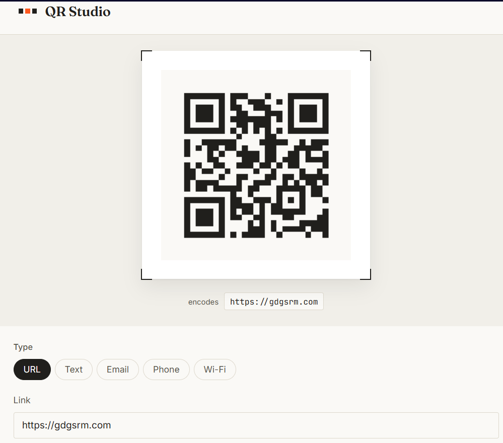
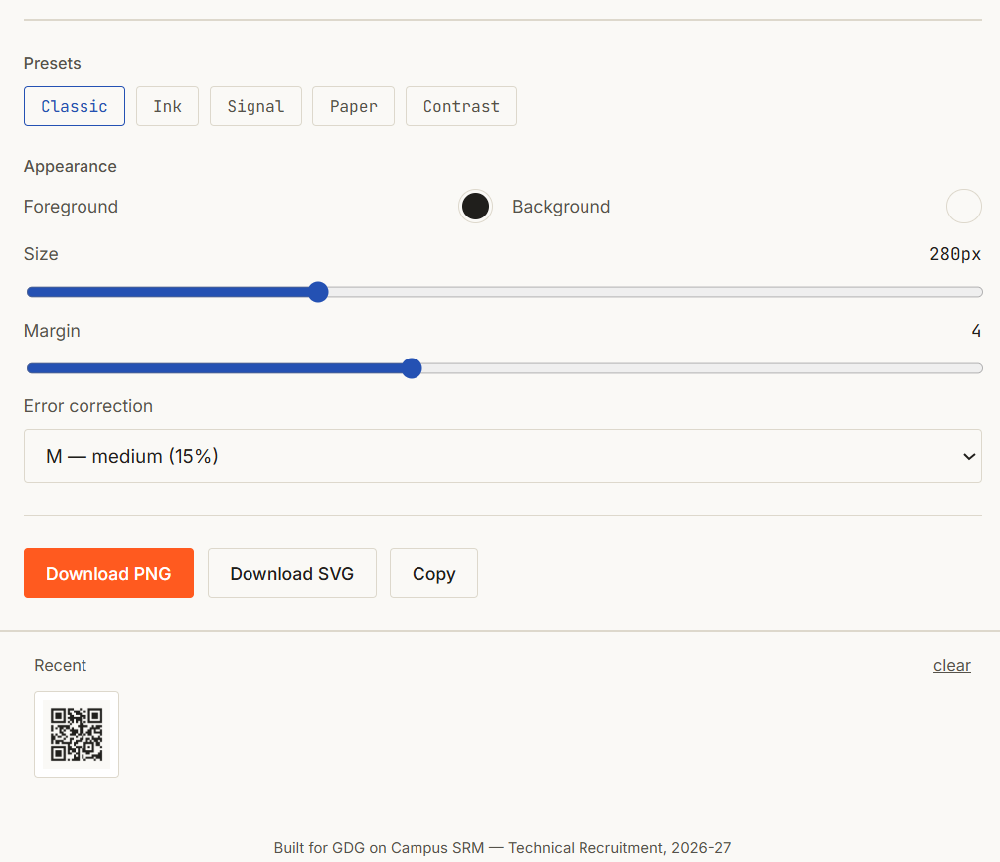

# QR Studio
**Live demo:** _https://qr-studio-mu-one.vercel.app/_

A browser-only QR code generator and designer, built for the **GDG on Campus SRM — Technical Recruitment 2026-27** 


## Screenshots

| QR preview | Customization panel |
|---|---|
|  |  |

## Features

- **Five QR types**: URL, plain text, email, phone number, Wi-Fi — each with its own inputs and validation.
- **Live preview**: the code re-renders as you type, with a ~180ms debounce.
- **Customization**: foreground/background color, size, margin, and error-correction level (L/M/Q/H), all reflected instantly.
- **Presets**: five predefined color combinations you can still tweak afterward.
- **Scan-safety warning**: flags low-contrast colors or a low error-correction level that could make a code hard to scan.
- **Downloads**: PNG and SVG export, plus copy-to-clipboard.
- **Recent codes**: the last 10 generated codes persist in `localStorage` and survive a page refresh; click one to reload it.
- **Responsive**: stacked layout on mobile, split panel on desktop.

## Tech

Vanilla HTML/CSS/JS — no framework, no package manager. QR encoding is done client-side with [`qrcode`](https://github.com/soldair/node-qrcode) (v1.5.1, MIT licensed, bundled locally in `js/qrcode.lib.js` rather than pulled from a CDN, so the app has zero external dependencies and works even on networks that block CDN hosts), which supports canvas rendering, PNG export, SVG export, and configurable error-correction levels. Google Fonts are still loaded remotely for typography; everything functional works offline once the page is cached.

```
qr-studio/
├── index.html
├── css/style.css
├── js/
│   ├── app.js          # app logic
│   └── qrcode.lib.js   # bundled QR encoding library
├── screenshots/
└── README.md
```

## Testing notes

Manually verified:
- All five QR types generate and scan correctly (tested with a phone camera).
- Customization options (color, size, margin, error correction) update the live preview and the downloaded file identically.
- Invalid input (bad URL, malformed email, missing Wi-Fi password on a secured network) shows an inline error instead of generating a broken code.
- Recent codes persist across a full page reload and can be reloaded by clicking them.
- Layout checked at 375px, 768px, and 1440px widths.

## Optional enhancements included

- SVG download
- Copy to clipboard
- Multiple color presets
